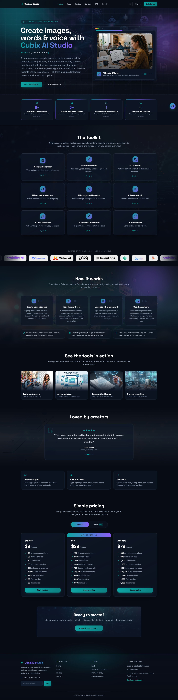
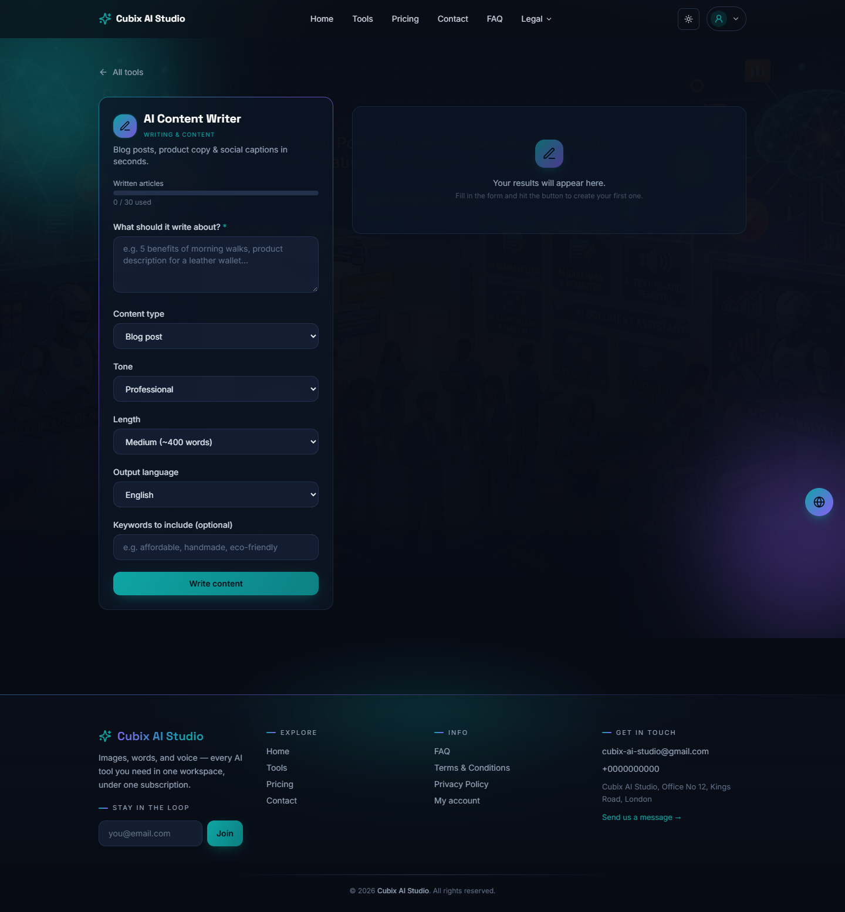
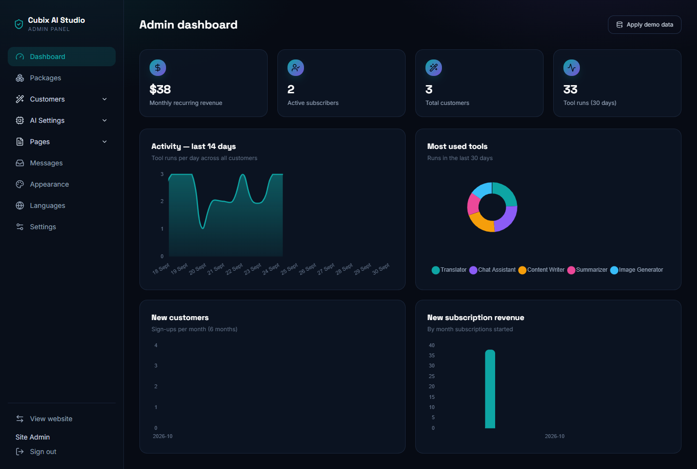
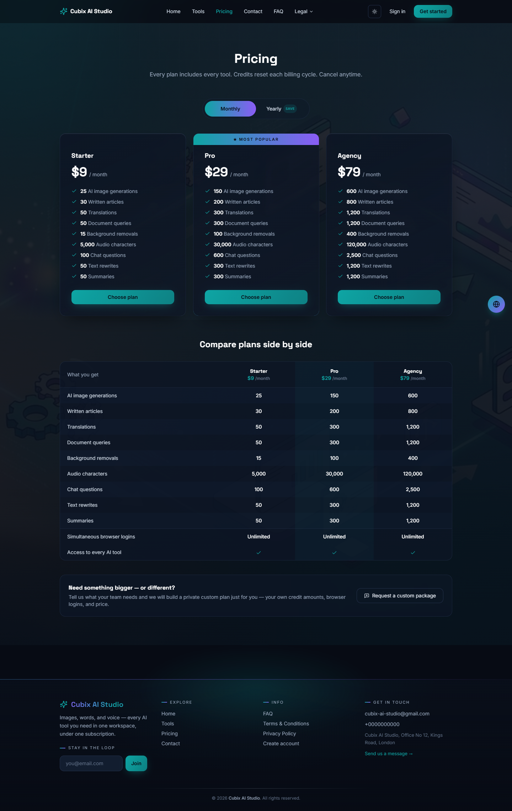
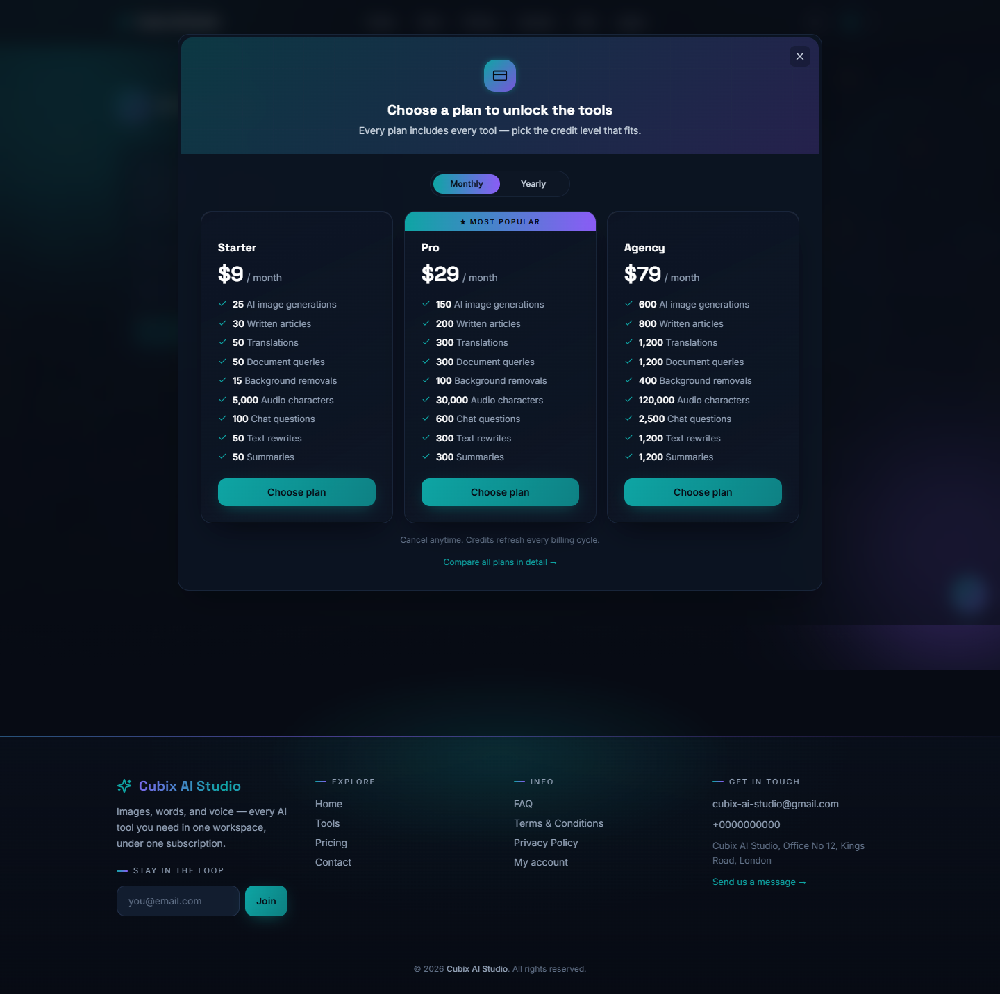
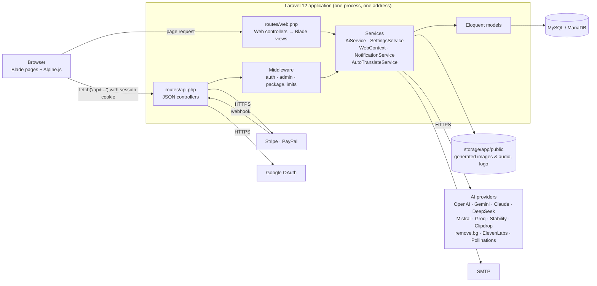
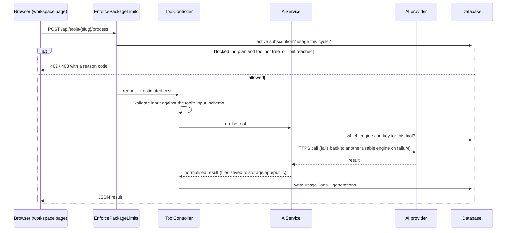

# Cubix AI Studio

An AI-tools SaaS platform built on **Laravel 12**. Customers sign up, pick a
subscription plan, and use nine AI workspaces (image generation, writing,
translation, document Q&A, background removal, text-to-audio, chat,
rewriting, summarising) against a per-plan credit allowance. An admin panel
controls everything else: plans, customers, AI providers and keys, pages,
menus, branding and languages.

It is a single application. The Blade frontend and the JSON API live in one
codebase and are served from one address — there is no separate frontend to
build or deploy.



---

## Contents

1. [Features](#1-features)
2. [Screenshots](#2-screenshots)
3. [Requirements](#3-requirements)
4. [System architecture](#4-system-architecture)
5. [Project structure](#5-project-structure)
6. [Setup from scratch](#6-setup-from-scratch)
7. [Configuration after install](#7-configuration-after-install)
8. [Useful commands](#8-useful-commands)
9. [Troubleshooting](#9-troubleshooting)
10. [Going live](#10-going-live)

---

## 1. Features

**For customers**

- Nine AI tools, each with its own workspace, result history and credit meter.
- Subscription plans (monthly and yearly) paid through Stripe or PayPal.
- Free mode: the admin can open individual tools to signed-in users without
  a plan, with a daily or monthly usage cap.
- Email/password sign-up and optional Google sign-in.
- Account page: profile, current plan and credits, password, email
  notification preferences.
- Dark and light themes, five interface languages (English, Spanish, French,
  Arabic with right-to-left layout, Mandarin Chinese).

**For the admin**

- Dashboard with revenue, subscribers, activity and most-used-tools charts.
- Packages: prices, billing cycle, per-tool credit limits, discounts,
  browser-session limits, and private custom packages for one customer.
- Customers: create, edit, block, assign a plan manually, adjust credits.
- AI settings: enable/disable tools, edit each tool's form, choose the AI
  engine per tool, store provider API keys (encrypted), test a key.
- Content: pages with shortcodes (`[pricing]`, `[tools]`, `[stats]`,
  `[cta]`), navigation menu, testimonials, contact inbox.
- Appearance: brand name, logo, colours, header/footer/loader styles.
- Languages: add a language and machine-translate every string.

**The nine tools**

| Tool | Credit counted as | Free by default |
|---|---|---|
| AI Image Generator | 1 per generation | Yes (5 uses) |
| AI Content Writer | 1 per article | Yes (4 uses) |
| AI Translator | 1 per translation | No |
| AI Document Assistant (PDF, DOCX, TXT) | 1 per question | No |
| AI Background Removal | 1 per image | No |
| AI Text-to-Audio | 1 per character | No |
| AI Chat Assistant | 1 per question | No |
| AI Grammar & Rewriter | 1 per rewrite | No |
| AI Summarizer | 1 per summary | No |

---

## 2. Screenshots

All screenshots are in [`screenshots/`](screenshots/), taken from a fresh
install with the demo data.

| Folder | Contents |
|---|---|
| [`screenshots/public/`](screenshots/public/) | Home, tools catalogue, pricing, contact, FAQ / Terms / Privacy pages, login, register, the sign-in gate, light theme, Arabic (RTL) and Spanish |
| [`screenshots/customer/`](screenshots/customer/) | Account page, all nine tool workspaces, pricing while signed in, and the upgrade gate for a customer with no plan |
| [`screenshots/admin/`](screenshots/admin/) | All 18 admin screens |
| [`screenshots/responsive/`](screenshots/responsive/) | Home, tools, pricing, login, a workspace and the admin dashboard at phone width |

| Tool workspace | Admin dashboard |
|---|---|
|  |  |

| Pricing | Upgrade gate (no plan) |
|---|---|
|  |  |

---

## 3. Requirements

| Requirement | Version | Notes |
|---|---|---|
| PHP | **8.4.1 or newer** | See the note below |
| PHP extensions | — | `pdo_mysql`, `mbstring`, `openssl`, `tokenizer`, `xml`, `ctype`, `json`, `bcmath`, `fileinfo`, `gd`, `curl`, `zip` |
| Database | MySQL 8 or MariaDB 10.4+ | Tested on MariaDB 10.4.32 (XAMPP) |
| Composer | 2.x | |
| Node.js | 18+ | **Optional.** Only to recompile Tailwind CSS after changing a class. Compiled CSS/JS ship in `public/assets/` |
| Internet access | — | Needed at runtime for AI providers, payments, Google sign-in and auto-translate |

> **PHP version.** `composer.json` declares `php ^8.2`, but the committed
> `composer.lock` pins Symfony 8 components that require PHP ≥ 8.4.1. With
> the lock file as shipped, PHP 8.2 or 8.3 stops at boot with *"Your
> Composer dependencies require a PHP version >= 8.4.1"*. This matters on
> XAMPP: many XAMPP installs bundle PHP 8.2, which is too old. Either use
> PHP 8.4 (for example [Laravel Herd](https://herd.laravel.com) or a newer
> XAMPP), or run `composer update` on your PHP version to re-resolve the
> dependencies — the second route has not been tested for this project.

**Accounts you will want** (all optional, all configured in the admin panel,
none in `.env`):

- At least one text AI key — OpenAI, Gemini, Claude, DeepSeek, Mistral or
  Groq. Image generation works with no key through the free Pollinations
  engine.
- Stability AI, Clipdrop or remove.bg for background removal; ElevenLabs or
  OpenAI for text-to-audio.
- Stripe and/or PayPal for payments.
- A Google OAuth client for Google sign-in.
- SMTP credentials for real email (until then, mail is written to
  `storage/logs/laravel.log`).

---

## 4. System architecture

### Overview



### How the pieces fit

**One app, two route files.** `routes/web.php` returns server-rendered Blade
pages. `routes/api.php` returns JSON. The pages are thin shells: each
interactive page declares an [Alpine.js](https://alpinejs.dev) component
(`x-data="…"`) that loads and saves its data by calling the app's own
`/api/*` endpoints with `fetch()`.

**Authentication.** Login is a normal Laravel session. The API routes sit
behind `auth:sanctum`, and `statefulApi()` in `bootstrap/app.php` lets
Sanctum accept the browser's session cookie, so the pages need no API token.
Admin routes add the `admin` middleware (`EnsureUserIsAdmin`), which checks
`users.role`.

**Settings live in the database, not `.env`.** API keys, payment keys,
branding and the per-tool engine choice are rows in the `settings` table,
read through `SettingsService` and cached for five minutes. Keys whose name
contains `_api_key`, `_secret`, `_token` or `_client_id` are encrypted with
the app key before being stored. `.env` only holds what Laravel needs to
boot: app key, URL, database and mail.

**Tools are data.** Each tool is a row in `ai_tools` with an `input_schema`
JSON column describing its form fields. One template,
`resources/views/workspace.blade.php`, renders every tool from that schema,
and the same schema validates the request server-side.

### What happens when a customer runs a tool



The credit check runs **before** the provider is called, and usage is logged
only after a successful result. A subscriber's usage is summed from the start
of their current billing cycle; a free user's is counted per day or per
month, as set on the tool.

### Billing

- **Stripe**: `BillingController::checkout` creates a Stripe Checkout
  session over Stripe's REST API (no SDK). Stripe then calls
  `POST /api/billing/webhook/stripe`; the signature is verified and the
  subscription is activated, renewed or cancelled. That one route is exempt
  from CSRF.
- **PayPal**: a billing plan is created on demand, the customer approves it
  on PayPal, and `GET /api/billing/paypal/return` activates the
  subscription.
- **Manual**: the admin can assign a plan to a customer directly.

### Data model

| Table | Holds |
|---|---|
| `users` | Customers and admins (`role`), status/blocked flag, notification preferences |
| `packages` | Plans: price, billing cycle, `features` JSON (credit limit per tool, `-1` = unlimited), discount, session limit, custom-package owner |
| `subscriptions` | A user's plan: gateway (`stripe`, `paypal`, `manual`), status, expiry, cancel flag |
| `ai_tools` | Tool catalogue: slug, icon, `input_schema`, `feature_key`, status, free-mode settings, category |
| `taxonomies` | Tool categories |
| `usage_logs` | One row per successful tool run — the source of every credit meter |
| `generations` | Saved inputs and outputs, shown as each tool's history |
| `settings` | Key/value configuration (secrets encrypted) |
| `languages` | Interface languages and their translation dictionaries |
| `site_pages`, `menu_items` | Admin-managed pages and navigation |
| `testimonials`, `contact_messages` | Homepage quotes and the contact inbox |
| `sessions`, `cache`, `jobs`, `personal_access_tokens` | Laravel infrastructure (sessions and cache are stored in the database) |

### Frontend

- **Tailwind CSS 3**, compiled to `public/assets/app.css` and committed.
- **Alpine.js** for interactivity, **Chart.js** for the admin dashboard —
  both vendored in `public/assets/`.
- `public/assets/app.js` holds shared behaviour: theme switching, the splash
  loader, micro-interactions, the settings-form engine used by the admin
  key/engine/settings screens.
- `App\Services\WebContext` gives every view the current language, the
  `t()` translation helper, branding and the menu.

### Scheduled work

One scheduled command, `subscriptions:send-expiry-reminders`, runs daily at
09:00 and emails customers whose plan is about to expire. It only runs if
the server's cron calls `php artisan schedule:run` every minute.

---

## 5. Project structure

```
app/
  Console/Commands/      DemoInstall (demo:install), SendExpiryReminders
  Http/
    Controllers/
      Web/               Blade pages — SiteController, AuthController
      Api/               JSON — Auth, Account, Billing, Contact, GoogleAuth,
                         Languages, Menu, Pages, Testimonials, Tool
      Api/Admin/         Admin JSON — Activity, Customer, Dashboard, Package,
                         Settings, Taxonomy, ToolManager
    Middleware/          EnforcePackageLimits, EnsureUserIsAdmin
  Models/                AiTool, ContactMessage, Generation, Language, MenuItem,
                         Package, Setting, SitePage, Subscription, Taxonomy,
                         Testimonial, UsageLog, User
  Services/
    AI/AiService.php     Every AI provider call and the engine fallbacks
    SettingsService.php  Typed access to the settings table
    WebContext.php       Per-request language, translations, branding, menu
    NotificationService.php    Account and plan emails
    AutoTranslateService.php   Machine translation of UI and content strings
    ContentTranslations.php, UiTranslations.php, UiStrings.php
                         Bundled translations so the demo is multilingual offline
  helpers.php            Global helpers (t(), brand(), …)

bootstrap/app.php        Routing, middleware aliases, CSRF exceptions
config/                  Standard Laravel configuration
database/
  migrations/            22 migrations
  seeders/               AiToolSeeder → LanguageSeeder → PagesMenuSeeder → DemoDataSeeder
public/
  assets/                app.css, app.js, alpine.min.js, chart.umd.js
  art/                   Illustrations and provider logos
resources/
  css/app.css            Tailwind source
  views/
    layouts/             app (public site), admin, bare (auth pages)
    partials/            Header/footer pieces, pricing grid, tool gate, loaders
    admin/               The admin screens
    auth/                Login, register, Google bridge
    home, tools, pricing, contact, page, workspace, account
routes/
  web.php                Blade page routes
  api.php                JSON routes
  console.php            The schedule
screenshots/             Screenshots of every part of the product
```

---

## 6. Setup from scratch

These steps were run on Windows with PHP 8.4 and XAMPP's MariaDB. The
commands are the same on macOS and Linux.

### Step 1 — Install the prerequisites

- PHP 8.4+ with the extensions listed in [Requirements](#3-requirements)
- Composer
- MySQL or MariaDB, running

Check them:

```bash
php -v          # must print 8.4.1 or newer
composer -V
```

### Step 2 — Get the code and install dependencies

```bash
cd cubix-ai-studio
composer install
```

### Step 3 — Create the environment file

```bash
cp .env.example .env          # Windows cmd: copy .env.example .env
php artisan key:generate
```

Open `.env` and check these values:

```ini
APP_URL=http://127.0.0.1:8000
FRONTEND_URL=http://127.0.0.1:8000

DB_CONNECTION=mysql
DB_HOST=127.0.0.1
DB_PORT=3306
DB_DATABASE=cubix_ai
DB_USERNAME=root
DB_PASSWORD=
```

`APP_URL` and `FRONTEND_URL` must be identical, and must match the address
you type in the browser exactly — `127.0.0.1` and `localhost` count as
different sites for cookies and for Google sign-in.

### Step 4 — Create the database

```sql
CREATE DATABASE cubix_ai CHARACTER SET utf8mb4 COLLATE utf8mb4_unicode_ci;
```

Run it in phpMyAdmin, or from a terminal with `mysql -u root -e "…"`.

### Step 5 — Build the tables and load the demo data

```bash
php artisan migrate
php artisan db:seed
```

`db:seed` with no `--class` runs all four seeders in order: the tools, plans
and admin account; the languages; the pages and menu; then demo customers,
testimonials and default settings. It is safe to re-run.

### Step 6 — Link storage

```bash
php artisan storage:link
```

Without this, uploaded logos and generated images and audio show as broken
links.

### Step 7 — Run it

```bash
php artisan serve --host=127.0.0.1 --port=8000
```

Open **http://127.0.0.1:8000**.

### Demo accounts

| Email | Password | Role |
|---|---|---|
| `admin@example.com` | `password` | Admin — panel at `/admin` |
| `liam@example.com` | `password` | Customer on the Starter plan |
| `fatima@example.com` | `password` | Customer on the Pro plan |
| `maya@example.com` | `password` | Customer with no plan (shows the upgrade gate) |

Change the admin password before putting the site anywhere public.

### Alternative: serve through XAMPP's Apache

Use this only if Apache's own PHP is 8.4+ (check `http://localhost/dashboard/phpinfo.php`).

1. Put the project in `htdocs` and follow steps 2–6 above.
2. In `.env` set both `APP_URL` and `FRONTEND_URL` to
   `http://localhost/cubix-ai-studio/public`.
3. In `apache/conf/httpd.conf`, set `AllowOverride All` on the `htdocs`
   `<Directory>` block and make sure
   `LoadModule rewrite_module modules/mod_rewrite.so` is not commented out.
   Restart Apache. Without this the home page loads and every other page is
   "Not Found".
4. Open `http://localhost/cubix-ai-studio/public`.

### Optional: recompile the CSS

Only after changing Tailwind classes:

```bash
npm install
npm run css
```

---

## 7. Configuration after install

Sign in as the admin and work through these in the panel:

1. **AI Settings → API Keys** — add at least one text provider key so the
   writing, translation, chat, rewriting, summarising and document tools
   work. Each key has a *Test* button.
2. **AI Settings → AI Engines** — choose which provider each tool uses.
3. **Settings** — currency, Stripe and PayPal keys and mode (test/live),
   Google sign-in, email notifications, business contact details.
4. **Packages** — adjust prices and credit limits; add your Stripe price IDs.
5. **Appearance** — brand name, logo, colours, header/footer/loader style.
6. **Languages** — enable languages and auto-translate new strings.

For file-upload tools, raise PHP's limits in `php.ini` if large files are
rejected:

```ini
upload_max_filesize = 25M
post_max_size = 25M
max_execution_time = 120
memory_limit = 256M
```

---

## 8. Useful commands

```bash
php artisan serve --port=8000      # run the app
php artisan optimize:clear         # clear caches — after any .env, route or view change
php artisan route:list             # every registered route
php artisan migrate:fresh --seed   # DELETES all data, rebuilds with demo content
php artisan demo:install           # same reset, plus machine-translates all languages
php artisan schedule:run           # run due scheduled commands (what cron should call)
php artisan tinker                 # PHP shell with the app booted
npm run css                        # recompile Tailwind
```

---

## 9. Troubleshooting

| Symptom | Cause and fix |
|---|---|
| *"Your Composer dependencies require a PHP version >= 8.4.1"* | The PHP that is running is too old. On machines with several PHPs, check which one `php -v` (CLI) and Apache each use. See [Requirements](#3-requirements). |
| `Failed to listen on 127.0.0.1:8000` | Another program holds the port, or it was released a moment ago. Find it with `netstat -ano \| findstr :8000`, stop it, wait a few seconds and retry — or use another `--port` and update `APP_URL`/`FRONTEND_URL` to match. On Windows, if the port is free and it still fails, start the server from a different terminal (Git Bash or cmd). |
| Database connection error | `DB_*` values in `.env` do not match the database, or MySQL is not running. Then `php artisan optimize:clear`. |
| Admin login fails, or the site looks empty | `php artisan db:seed` was skipped or run with a single `--class`. |
| Signed in, but tools or admin screens stay empty | `APP_URL` does not match the browser address (`127.0.0.1` vs `localhost`), so the session cookie is not sent to `/api/*`. |
| Images, audio or the logo are broken | Run `php artisan storage:link`. |
| A text tool says no engine is set up | No text provider key yet — Admin → AI Settings → API Keys. |
| Home loads, other pages are "Not Found" (Apache) | `AllowOverride All` / `mod_rewrite` not enabled, or Apache not restarted. |
| A change does not show up | `php artisan optimize:clear`, then hard-refresh (`Ctrl+Shift+R`). |

---

## 10. Going live

1. Point the domain at the server; the web root is the project's `public/`
   folder.
2. In `.env`: set `APP_URL` and `FRONTEND_URL` to the `https://` domain,
   `APP_ENV=production`, `APP_DEBUG=false`.
3. Change the default admin password and remove the demo customers.
4. Update the Google OAuth redirect URI and the Stripe webhook URL
   (`https://your-domain/api/billing/webhook/stripe`) to the live domain,
   and switch Stripe/PayPal to live mode in Admin → Settings.
5. Set real SMTP credentials (`MAIL_*`) so account and plan emails are sent.
6. Add the cron entry for the scheduler:
   `* * * * * cd /path/to/project && php artisan schedule:run >> /dev/null 2>&1`
7. Install an SSL certificate.
8. Cache for speed once everything works:

   ```bash
   php artisan config:cache
   php artisan route:cache
   php artisan view:cache
   ```

   Any later change needs `php artisan optimize:clear` first.

### Updating a running site

1. Replace the files with the new version.
2. `php artisan migrate` if the update includes new migrations.
3. `php artisan optimize:clear`.
4. `php artisan db:seed` only if the update ships new seeded content.
5. Hard-refresh the browser.
